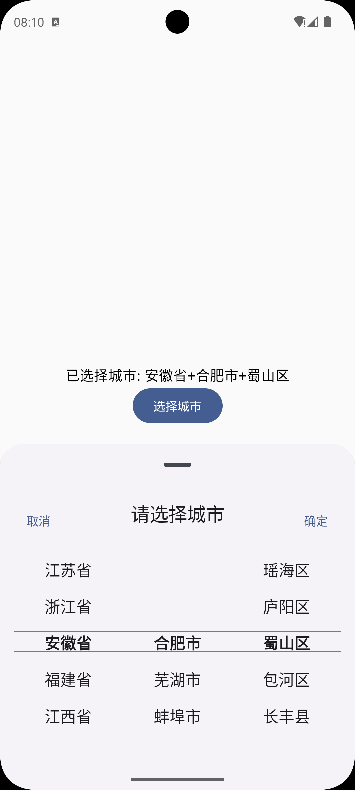

[](https://jitpack.io/#simonniex/SimonCityPicker2)

基于Kotlin DSL开发的全新版本！！！
# 基于JetpackCompose的省市县级联选择器
## 环境

* **环境**:
    - material3:1.3.0
    - compose:1.5.0
    - kotlinx-serialization-json:1.6.3

## 实现思路

1.从 JSON 文件中加载和解析数据，提供省、市、区数据。

2.利用状态管理和LazyListState实现三级联动

3.使用JetpackCompose等处理交互逻辑与UI管理

4.新增flow等高阶用法

## 使用方式
### setting.gradle

```Kotlin
dependencyResolutionManagement {
    repositoriesMode.set(RepositoriesMode.FAIL_ON_PROJECT_REPOS)
    repositories {
        google()
        mavenCentral()
        maven { url = uri("https://jitpack.io") }
    }
}
```
### build.gradle(:app)
```Kotlin
    implementation ("com.github.simonniex:SimonCityPicker2:2.4.0")
```

---

## 案例
```Kotlin
@Composable
fun Demo() {
    // 创建一个上下文用于 Toast
    val context = LocalContext.current

    // 选择城市的状态
    var selectedCity by remember { mutableStateOf("请选择城市") }
    var isCityPickerVisible by remember { mutableStateOf(false) }
    Box(
        modifier = Modifier.fillMaxSize()
    ) {
        Column(
            modifier = Modifier
                .fillMaxSize()
                .padding(16.dp),
            verticalArrangement = Arrangement.Center,
            horizontalAlignment = Alignment.CenterHorizontally
        ) {
            // 显示选择的城市
            Text(text = "已选择城市: $selectedCity")

            // 按钮用于显示城市选择器
            Button(onClick = { isCityPickerVisible = true }) {
                Text(text = "选择城市")
            }

        }
        // 调用城市选择器
        if (isCityPickerVisible) {
            SimonCityPicker(
                context=context,
                isCity = true,
                onCitySelected = { city ->
                    selectedCity = city
                    isCityPickerVisible = false // 选择后隐藏选择器
                }
            )
        }
    }
}

## 效果展示

[](https://raw.githubusercontent.com/simonniex/SimonCityPicker2/master/images/img.png)
